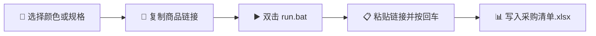
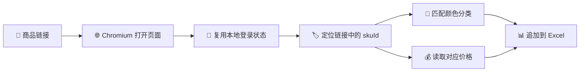

<div align="center">

<h1>🛒 TaoBao Procurement Automation</h1>
<h3>淘宝 / 天猫采购清单自动化工具</h3>

<p>
选择商品规格，粘贴链接，自动记录对应的颜色分类与价格。<br>
Select a product variant, paste its link, and save the matching SKU and price.
</p>

<p>
  
  
  
  
</p>

</div>

---

## 🚀 快速开始 / Quick Start

> [!IMPORTANT]
> 目前仅支持 **Windows 10 / 11**。电脑只需要提前安装
> [Python 3.10 或更高版本](https://www.python.org/downloads/)，安装 Python 时
> 请勾选 **Add Python to PATH**。其他依赖会由 Setup 自动安装。

### 第一次使用 / First Run

### [⬇️ 下载最新版 ZIP / Download Latest ZIP](https://github.com/jineonbaek/taobao-procurement-automation/archive/refs/heads/master.zip)

| 步骤 | 操作 |
|---:|---|
| 1️⃣ | 从 GitHub 下载项目 ZIP，并**完整解压**到普通文件夹。<br>Download the ZIP and extract the whole folder. |
| 2️⃣ | 双击 **`setup.bat`**。<br>Double-click **`setup.bat`**. |
| 3️⃣ | 等待程序自动安装环境和 Chromium。首次安装可能需要几分钟。<br>Wait while the local environment and Chromium are installed. |
| 4️⃣ | 按提示输入淘宝账号；如果出现短信、滑块或身份验证，请在弹出的浏览器中完成。<br>Sign in and finish any verification in the opened browser. |

> [!TIP]
> 不需要提前安装 Chrome、Edge、Microsoft Excel、Playwright 或 openpyxl。
> You do not need to preinstall Chrome, Edge, Microsoft Excel, Playwright, or
> openpyxl.

### 每次使用 / Daily Use



1. 在淘宝或天猫中先选择需要的**颜色分类 / 商品规格**。
2. 复制商品链接。
3. 双击 **`run.bat`**，粘贴链接并按回车。
4. 在项目文件夹中打开 **`采购清单.xlsx`** 查看结果。
5. 输入 **`q`** 退出。

### ✅ 输出结果 / Result

```text
[黑色 12.3英寸 触摸屏] ￥557.98
```

| 日期 Date | 采购物品 Item | 数量 Qty | 渠道 Source | 价格 Price | 链接 Link |
|---|---|---|---|---|---|
| 07-27 | 黑色 12.3英寸 触摸屏 | 1 | Taobao | ￥557.98 | 打开链接 |

> [!WARNING]
> 付款前请在淘宝 / 天猫中再次确认最终规格和价格。短链接能否保留已选 SKU，
> 取决于淘宝跳转时是否保留对应信息。

> [!CAUTION]
> 淘宝账号和登录 Cookie 只保存在本机的 `data/` 中。不要把整个运行后的文件夹
> 直接发给别人。Your Taobao credentials and cookies stay in the local `data/`
> folder. Never share the complete folder after running Setup.

---

## 📚 完整说明 / Full Guide

以下内容介绍功能、安装原理、本地文件、隐私保护、卸载和故障排查。<br>
The sections below keep the full technical, privacy, uninstall, and
troubleshooting details.

---

## ✨ Features / 功能

| English | 中文 |
|---|---|
| Supports Taobao/Tmall long links and share short links | 支持淘宝/天猫长链接和分享短链接 |
| Resolves redirects automatically in Chromium | 使用 Chromium 自动跟随短链接跳转 |
| Reads the selected color classification when the link contains a valid `skuId` | 链接包含有效 `skuId` 时，读取已选择的颜色分类 |
| Reads the price currently associated with that SKU | 读取当前 SKU 对应的价格 |
| Appends the result to `采购清单.xlsx` | 自动追加到 `采购清单.xlsx` |
| Reuses local login cookies for daily operation | 日常运行时复用本地登录 Cookie |

Example output / 输出示例：

```text
[黑色 12.3英寸 触摸屏] ¥557.98
```

> For the most accurate single-SKU result, select the required color or
> specification before copying the product link.
>
> 为获得最准确的单个 SKU 结果，请先在淘宝/天猫中选择需要的颜色或规格，再复制
> 商品链接。

---

## ⚙️ How It Works / 工作原理



`setup.bat` prepares the local runtime once. `run.bat` then opens the link in
the project Chromium, reuses the saved login cookies, matches the selected SKU,
reads its current price, and appends one row to the workbook.

`setup.bat` 负责一次性准备本地运行环境。之后 `run.bat` 会使用项目内 Chromium
打开链接、复用已保存的登录 Cookie、匹配已选 SKU、读取对应价格，并向采购清单
追加一行。

---

## 🖥️ Supported Platform / 支持平台

This release is designed for:

- Windows 10
- Windows 11
- Python 3.10 or newer

当前版本仅面向 Windows 10/11，并要求安装 Python 3.10 或更高版本。

The `.bat` and PowerShell startup workflow is not currently designed for macOS
or Linux.

当前 `.bat` 和 PowerShell 启动流程不支持 macOS 或 Linux。

---

## 🧰 Requirements / 环境要求

### Required before Setup / 运行 Setup 前需要

| Requirement | 说明 |
|---|---|
| Python 3.10+ | 安装 Python 时必须勾选 **Add Python to PATH** |
| Internet connection | 用于安装依赖、下载 Chromium 和访问淘宝 |
| Taobao account | 建议使用未绑定支付信息的专用账号 |
| Free disk space | `.venv` 和 `.playwright-browsers` 需要数百 MB 空间 |

### Not required / 不需要提前安装

- Google Chrome or Microsoft Edge / Chrome 或 Edge
- Microsoft Excel / Microsoft Excel
- Git, when downloading the repository as ZIP / 如果下载 ZIP，则不需要 Git
- Playwright or openpyxl / Playwright 或 openpyxl

`setup.bat` installs the required Python packages and Playwright Chromium
automatically.

`setup.bat` 会自动安装所需 Python 包和 Playwright Chromium。

---

## 🛠️ First-Time Setup / 首次配置

### 1. Install Python / 安装 Python

Download Python 3.10 or newer from [python.org](https://www.python.org/downloads/).
During installation, enable:

```text
Add Python to PATH
```

从 Python 官网安装 Python 3.10 或更高版本，并务必勾选：

```text
Add Python to PATH
```

### 2. Download the project / 下载项目

Clone the repository with Git, or download and extract the GitHub ZIP archive.

可以使用 Git 克隆仓库，也可以从 GitHub 下载 ZIP 并完整解压。

### 3. Run Setup / 运行 Setup

Double-click:

```text
setup.bat
```

Setup performs the following operations:

1. Finds a compatible Python 3.10+ installation.
2. Creates a project-local `.venv`.
3. Installs packages from `requirements.txt`.
4. Downloads or checks Playwright Chromium in `.playwright-browsers`.
5. Verifies that Chromium can start.
6. Requests the Taobao phone number and password.
7. Opens a visible Chromium window for login and additional verification.
8. Saves the login cookies locally.

Setup 会依次执行：

1. 检测 Python 3.10+。
2. 在项目内创建 `.venv`。
3. 根据 `requirements.txt` 安装依赖。
4. 在 `.playwright-browsers` 中下载或检查 Playwright Chromium。
5. 验证 Chromium 可以正常启动。
6. 提示输入淘宝手机号和密码。
7. 打开可见 Chromium 窗口完成登录和额外验证。
8. 将登录 Cookie 保存在本地。

If Taobao requests SMS, slider, or identity verification, complete it in the
opened Chromium window. The setup waits for up to five minutes.

如果淘宝要求短信、滑块或身份验证，请在打开的 Chromium 窗口内完成。Setup 最多
等待五分钟。

Both the Python environment and Chromium are stored inside this project. Setup
does not install Playwright packages or this browser into the global Python
environment.

Python 环境和 Chromium 都保存在本项目文件夹内。Setup 不会把 Playwright 包或
这个浏览器安装到全局 Python 环境。

---

## 📦 What Is `.venv`? / `.venv` 是什么？

`.venv` is the private Python environment created for this project.

`.venv` 是 Setup 为本项目创建的独立 Python 环境。

```text
purchase workflow/
└── .venv/
    ├── Python
    ├── Playwright
    ├── openpyxl
    └── other required packages
```

It ensures that Setup and Run always use the same Python and dependencies. It
does not modify the global Python packages installed on the computer.

它可以保证 Setup 和 Run 始终使用同一套 Python 与依赖，不会把这些依赖安装到
电脑的全局 Python 环境。

- Created automatically by `setup.bat` / 由 `setup.bat` 自动创建
- Used automatically by `run.bat` / 由 `run.bat` 自动调用
- Excluded from GitHub by `.gitignore` / 已通过 `.gitignore` 排除
- Safe to delete, but Setup must be run again afterward / 可以删除，但删除后必须重新运行 Setup

Playwright Chromium is stored separately in `.playwright-browsers` so it can be
removed safely without affecting browsers used by other projects.

Playwright Chromium 单独保存在 `.playwright-browsers` 中，因此删除它不会影响
其他项目使用的浏览器。

---

## ▶️ Daily Use / 日常使用

Double-click:

```text
run.bat
```

Then:

1. Paste a Taobao/Tmall product link.
2. Press Enter.
3. Wait for parsing to finish.
4. Check `采购清单.xlsx`.
5. Enter `q` to quit.

使用步骤：

1. 粘贴淘宝/天猫商品链接。
2. 按回车。
3. 等待解析完成。
4. 在 `采购清单.xlsx` 中查看结果。
5. 输入 `q` 退出。

The program supports both long and short links, but a shared short link can only
preserve the selected SKU if Taobao includes the SKU information in the redirect.

程序支持长链接和短链接，但短链接是否能保留已选 SKU，取决于淘宝跳转时是否保留
相应 SKU 信息。

---

## 📊 Excel Output / Excel 输出

The generated workbook is:

```text
采购清单.xlsx
```

Columns / 列格式：

| 日期 Date | 采购物品 Item | 数量 Qty | 渠道 Source | 价格 Price | 链接 Link |
|---|---|---|---|---|---|
| 07-27 | 黑色 12.3英寸 触摸屏 | 1 | Taobao | ¥557.98 | 打开链接 |

The workbook is generated locally and is excluded from Git.

采购清单仅在本地生成，已通过 `.gitignore` 排除，不会被 Git 上传。

---

## 🗂️ Project Structure / 项目结构

### Files uploaded to GitHub / 上传到 GitHub 的源码文件

```text
purchase workflow/
├── .gitignore
├── README.md
├── requirements.txt
├── setup.bat
├── setup.ps1
├── run.bat
├── run.ps1
├── uninstall.bat
├── uninstall.ps1
└── taobao_parser.py
```

| File | Purpose / 用途 |
|---|---|
| `setup.bat` | Double-click entry for first-time setup / 首次配置双击入口 |
| `setup.ps1` | Creates `.venv`, installs dependencies, and configures login / 创建环境、安装依赖并配置登录 |
| `run.bat` | Double-click entry for daily use / 日常使用双击入口 |
| `run.ps1` | Validates local configuration and starts the parser / 检查本地配置并启动解析器 |
| `uninstall.bat` | Double-click entry for uninstalling local runtime files / 一键卸载本地运行文件 |
| `uninstall.ps1` | Safely removes only selected files inside this project / 仅安全删除本项目内选定的文件 |
| `taobao_parser.py` | Taobao/Tmall parsing and Excel output / 淘宝天猫解析与 Excel 输出 |
| `requirements.txt` | Python dependency list / Python 依赖列表 |
| `.gitignore` | Prevents private/runtime files from being uploaded / 防止隐私和运行文件被上传 |

### Files generated locally / 本地自动生成文件

```text
.venv/                         Project Python environment / 项目 Python 环境
.playwright-browsers/          Project Chromium browser / 项目专用 Chromium 浏览器
data/.taobao.env               Taobao credentials / 淘宝账号密码
data/.taobao_cookies.json      Login cookies / 登录 Cookie
采购清单.xlsx                   Output workbook / 输出采购清单
```

These files are not part of the GitHub repository.

这些文件不属于 GitHub 仓库内容。

---

## 🔐 Security and Privacy / 安全与隐私

Important:

- `data/.taobao.env` stores the Taobao phone number and password in plain text.
- `data/.taobao_cookies.json` contains an authenticated login session.
- Never upload, commit, email, or share the `data/` directory.
- Use a dedicated Taobao account without payment information whenever possible.
- Do not share `采购清单.xlsx` if it contains private purchasing information.

重要说明：

- `data/.taobao.env` 会以明文保存淘宝手机号和密码。
- `data/.taobao_cookies.json` 包含有效登录会话。
- 请勿上传、提交、发送或分享整个 `data/` 目录。
- 建议使用未绑定支付信息的专用淘宝账号。
- 如果采购清单包含私人采购信息，请勿随意分享。

The `.gitignore` file excludes:

```text
data/
.venv/
.playwright-browsers/
*.xlsx
.claude/
.vscode/
.idea/
__pycache__/
```

> `.gitignore` protects Git uploads only. If you manually ZIP the entire project
> folder, delete `data/`, `.venv/`, `.playwright-browsers/`, and private Excel
> files before sharing.
>
> `.gitignore` 只保护 Git 上传。如果直接压缩整个项目文件夹发送给别人，请先删除
> `data/`、`.venv/`、`.playwright-browsers/` 和私人 Excel 文件。

---

## 🧹 One-Click Uninstall / 一键卸载

Double-click:

```text
uninstall.bat
```

Choose one of these modes:

1. **Safe uninstall (recommended):** removes `.venv`,
   `.playwright-browsers`, credentials, and login cookies, but keeps
   `采购清单.xlsx`.
2. **Full cleanup:** removes everything above and also deletes
   `采购清单.xlsx`.

Then type `UNINSTALL` exactly to confirm. Source files such as `.py`, `.ps1`,
`.bat`, and `README.md` are always kept. Run `setup.bat` later to reinstall the
local environment.

双击 `uninstall.bat` 后可选择：

1. **安全卸载（推荐）：**删除 `.venv`、`.playwright-browsers`、淘宝账号密码和
   登录 Cookie，但保留 `采购清单.xlsx`。
2. **彻底清理：**在上述基础上同时删除 `采购清单.xlsx`。

随后必须准确输入 `UNINSTALL` 才会执行。`.py`、`.ps1`、`.bat` 和 `README.md`
等源码始终保留；以后重新双击 `setup.bat` 即可安装。

The uninstaller does not remove `%LOCALAPPDATA%\ms-playwright`, which may have
been created by an older version and may be shared by other Playwright projects.

卸载程序不会删除旧版本可能创建的 `%LOCALAPPDATA%\ms-playwright`，因为该目录
可能被其他 Playwright 项目共用。

---

## ♻️ Reset or Reinstall / 重置或重新安装

### Reset Taobao login / 重置淘宝登录

Delete:

```text
data/.taobao_cookies.json
```

Then run `setup.bat` again.

删除 `data/.taobao_cookies.json`，然后重新运行 `setup.bat`。

### Remove all local account data / 删除全部本地账号数据

Delete:

```text
data/
```

Then run `setup.bat` again.

删除整个 `data/` 文件夹，然后重新运行 `setup.bat`。

### Rebuild the local runtime / 重建本地运行环境

Delete:

```text
.venv/
.playwright-browsers/
```

Then run `setup.bat` again.

删除 `.venv` 和 `.playwright-browsers`，然后重新运行 `setup.bat`。也可以直接
运行 `uninstall.bat` 并选择安全卸载。

---

## 🩺 Troubleshooting / 常见问题

| Problem / 问题 | Solution / 解决方法 |
|---|---|
| Python 3.10+ was not found / 找不到 Python 3.10+ | Reinstall Python and enable **Add Python to PATH** / 重新安装 Python 并勾选该选项 |
| Package installation failed / Python 包安装失败 | Check the network, proxy, VPN, and firewall, then rerun Setup / 检查网络、代理、VPN 和防火墙后重试 |
| Chromium installation failed / Chromium 安装失败 | Disable an interfering VPN/proxy or allow Playwright through the firewall / 关闭干扰连接的 VPN/代理或放行 Playwright |
| Chromium verification window appeared / 出现淘宝验证窗口 | Complete SMS, slider, or identity verification in the opened window / 在窗口内完成短信、滑块或身份验证 |
| Login expired / 登录失效 | Delete `data/.taobao_cookies.json` and rerun Setup / 删除 Cookie 文件并重新运行 Setup |
| `run.bat` reports that the local environment is missing / Run 提示本地环境不存在 | Run `setup.bat` first / 先运行 Setup |
| `run.bat` reports that the browser is missing / Run 提示浏览器不存在 | Run `setup.bat` again / 重新运行 Setup |
| Product page loads slowly / 商品页面加载很慢 | Check the internet connection and try without VPN / 检查网络并尝试关闭 VPN |
| Selected color cannot be mapped / 无法识别已选颜色 | Confirm that the copied link contains a valid `skuId`, then copy the link again after selecting the SKU / 确认链接包含有效 `skuId`，选择规格后重新复制 |

---

## ⌨️ Manual Command / 手动运行命令

Daily use should normally start from `run.bat`. For debugging, the equivalent
manual command is:

日常使用建议双击 `run.bat`。调试时可以使用：

```powershell
.\.venv\Scripts\python.exe .\taobao_parser.py "<Taobao/Tmall URL>"
```

Do not use the global `python` command unless its dependencies were installed
separately.

除非已经单独安装依赖，否则不要使用全局 `python` 命令运行。

---

## 🚢 GitHub Publishing Checklist / GitHub 上传检查

Before committing or pushing:

- Confirm that `git status` does not include `data/`.
- Confirm that no `.xlsx` file is staged.
- Confirm that `.venv/` is not staged.
- Confirm that `.playwright-browsers/` is not staged.
- Confirm that no phone number, password, or Cookie is hard-coded in source files.

提交或推送前请确认：

- `git status` 中没有 `data/`。
- 没有暂存任何 `.xlsx` 文件。
- 没有暂存 `.venv/`。
- 没有暂存 `.playwright-browsers/`。
- 源码中没有硬编码手机号、密码或 Cookie。

Only the source files listed in the Project Structure section should be uploaded.

只应上传“项目结构”中列出的源码文件。

---

## ⚠️ Notes and Limitations / 注意事项与限制

- Taobao/Tmall may change page structures, login rules, or internal APIs.
- Login automation may occasionally require manual verification.
- Prices can vary by account, region, promotion, time, and selected SKU.
- Use the value displayed by the program as procurement assistance, and confirm
  the final price in Taobao/Tmall before payment.

- 淘宝/天猫可能随时修改页面结构、登录规则或内部接口。
- 自动登录有时仍需要人工完成安全验证。
- 价格可能受账号、地区、活动、时间和 SKU 影响。
- 程序结果仅用于辅助采购，付款前请在淘宝/天猫中再次确认最终价格。
